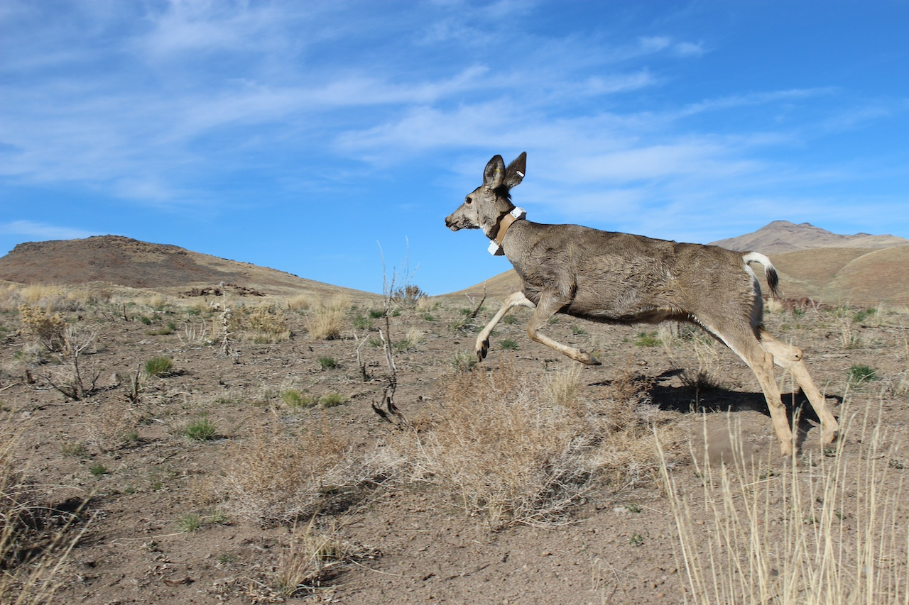

---
output:
  html_document:
    theme: yeti
---

#### [**Current FFEL Research Projects**]{.ul}
 

### **Habitat Suitability for Big Spring Spinedace (Lepidomeda mollispinis pratensis) in Meadow Valley Wash, Nevada**

 
[**Project Personnel**]{.ul} 
**Dr. Jeff Falke (PI)**  
**Mark Kolwyck (Staff Scientist)**

The Big Spring Spinedace (Lepidomeda mollispinis pratensis) is a Federally threatened cyprind fish with a distribution limited to a single 5-km stream reach in Meadow Valley Wash, Lincoln County, NV. Little is known about the life history, habitat requirements, or demographics of this species. In 1994, the U.S. Fish and Wildlife Service set goals and objectives for recovery of BSS that included selection and establishment of refuge populations due to the vulnerability of the existing population to catastrophic events, human-induced habitat modification, and nonnative species introduction, and indicated that information collected on life history and habitat requirements should be utilized to evaluate potential refugia sites.This project is a collaboration among the **U.S. Geological Survey**, **Nevada Cooperative Fish and Wildlife Research Unit**, **U.S. Fish and Wildlife Service**, and the **Nevada Department of Wildlife**. We will establish criteria to evaluate Big Spring Spinedace habitat suitability via a literature review and pre-assessment analysis, conduct flow permanence surveys, monitor water levels and temperatures, and survey occupied and potential re-introduction sites for habitat suitability. We expect to recommend a prioritized list of sites that could be used as refuge population(s) for Big Spring Spinedace in and around Meadow Valley Wash, Nevada.

### **Integrated Monitoring Plan Development for Native and Non-Native Fishes at Ash Meadows National Wildlife Refuge, Nevada**

 
[**Project Personnel**]{.ul} 
**Dr. Jeff Falke (PI)**  
**Dr. Dara Yiu (Post-doctoral Researcher)**

Monitoring for population status and trends is a critical component to successful conservation and management of freshwater fishes. However, integrated status and trend monitoring efforts for native and invasive fishes that combine traditional active and passive capture methods with single- and multiple-species eDNA assays have yet to be developed for desert ecosystems. A modern, formalized sampling design, analysis, and reporting framework is needed to institutionalize science-based management and advance our understanding of native and nonnative fishes at Ash Meadows National Wildlife Refuge (AMNWR), Nevada. The project is a collaboration of researchers across multiple agencies and includes the **U.S. Geological Survey**, **University of Nevada, Reno**, **Washington State University**, **U.S. Fish and Wildlife Service Desert Refuge Complex**, and the **Nevada Department of Wildlife**. We will develop a peer reviewed integrated status and trend monitoring plan for native and non-native aquatic taxa at AMNWR that incorporates eDNA assays, traditional fish sampling, and structured decision making.

### **Landscape Watershed Condition and Drought Vulnerability Assessment in the Western U.S.**

 
[**Project Personnel**]{.ul} 
**Dr. Jeff Falke (PI)**  
**Christopher Frazier (PhD Student)**

Climate warming and persistent drought have drawn increasing attention to declining availability of water across western landscapes. However, a knowledge gap in our understanding of ecological drought effects in dryland ecoregions is how watershed conditions (e.g., instream habitat conditions, riparian and upland
vegetation health) and hydrology (e.g., stream flows, water temperatures and quality) interact to affect the flow of energy from aquatic to terrestrial habitats and vice versa. Our assessment framework will include a fully integrated, social-ecological assessment of drought vulnerability within watersheds in the Great Basin and Western U.S. Such an assessment is designed with the specific intent of informing drought adaptation actions in the face of increasing concerns over drought and climate change. The project is a collaboration of researchers across **USGS** including the **Cooperative Research Units**, **Northern Rocky Mountain Science Center**, and **Forest and Rangeland Ecosystem Science Center**.

 

### **Mapping Ungulate Migrations in Nevada**

 
[**Project Personnel**]{.ul} 
**Dr. Brian Folt (co-PI)**  
**Dr. Jeff Falke (co-PI)**  
**Dr. Nathan Jackson (Post-doctoral Researcher)**

Large-scale land-use changes threaten to fragment habitats and disrupt seasonal migration corridors of large ungulates that are important to population growth and persistence. By identifying important habitats and migration corridors for ungulate populations in Nevada, land-use planning might accommodate requirements for ungulates in addition to other multiple uses on landscapes. To this end, we are participating in a large-scale research project that aims to identify important habitats and migration corridors for ungulate populations across Nevada. We are collaborating with **Nevada Department of Wildlife** to analyze existing GPS-collar data describing seasonal movement patterns of Mule Deer, Pronghorn, and Elk and provide maps estimating seasonal ranges and migration corridors for different populations across the state. Land-use planning decisions across Nevada could benefit from the resulting spatial information describing key habitats and migration corridors for ungulates in the state, potentially to be used as exclusion criteria. Additionally, we will produce a synthetic analysis of all ungulate migration corridors in the state and work with the state to develop a decision-support analysis at a large scale, given their needs.

### **Downscaling recent and future stream temperatures across two large sub-Arctic watersheds: Assessing effects on freshwater habitat potential and productivity**

 
[**Project Personnel**]{.ul} 
**Dr. Jeff Falke (co-PI)**  
**Rebecca Shaftel (PhD Candidate [University of Alaksa Fairbanks])**

Linking climate change effects to animals with complex life histories is especially challenging because it requires downscaling climatic data to spatial and temporal scales that match the experience of different life stages. Pacific Salmon (Oncorhynchus spp.) utilize both freshwater and marine ecosystems and populations in Alaska are undergoing some of the fastest rates of climate change and have suffered recent declines in abundance. Stream temperatures are highly variable across diverse stream habitats in Alaska, but recent research has indicated that warming temperatures may negatively affect migrating adult salmon and productivity in some systems, while positively affecting juvenile growth and development in others. In the Yukon and Kuskokwim Rivers of sub-Arctic Alaska, Chinook Salmon (O. tshawytscha) populations have suffered dramatic declines over the last three decades and developing tools to understand how recent stream temperatures have affected these populations is an urgent research need.
 
 
<!-- Simple Dark Blue Footer -->

  
 Copyright &copy; Jeff Falke, 2024--present. All rights reserved.

  

