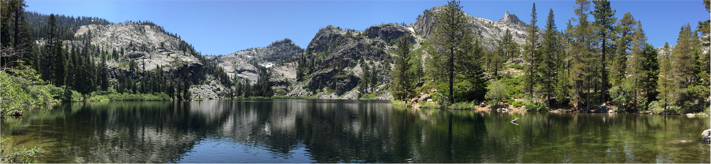
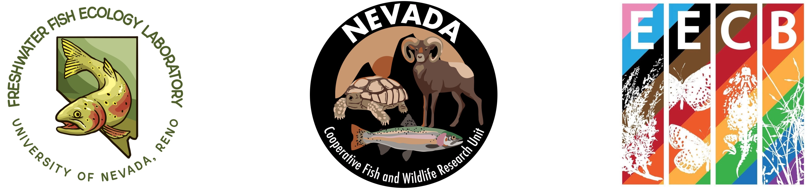

---
output:
  html_document:
    theme: yeti
---

The **Freshwater Fish Ecology Lab** is a aquatic science research laboratory in the [Nevada Cooperative Fish and Wildlife Research Unit](https://www.unr.edu/nvcfwru) at the [University of Nevada, Reno](https://www.unr.edu/nres). 

Our mission is to conduct applied research to guide conservation and
management of fisheries and aquatic ecosystems.

On this site, you can learn about [who we are](members.html), our [research interests](research.html) and [publications ](publications.html). We will post advertisements for graduate student and scientist opportunities [here](prospective_students.html) as well.

Please reach out if you are interested in joining our team or collaborating with us!
 
 

**Contact information:** 
[Dr. Jeff Falke](https://www.unr.edu/nvcfwru/falke-jeff) 
Unit Leader 
U.S. Geological Survey, [Nevada Cooperative Fish and Wildlife Research Unit](https://www.unr.edu/nvcfwru) 
University of Nevada, Reno 
Office: 100D Knudtsen Resource Center, 1000 Valley Road, Reno, NV 89512 
Mail: 1664 N. Virginia Street, Mail Stop 405, Reno, NV 89557 
Email: [jfalke@unr.edu](mailto:jfalke@unr.edu) 

 

<!-- Simple Dark Blue Footer -->

  
 Copyright &copy; Jeff Falke, 2024--present. All rights reserved.

  

