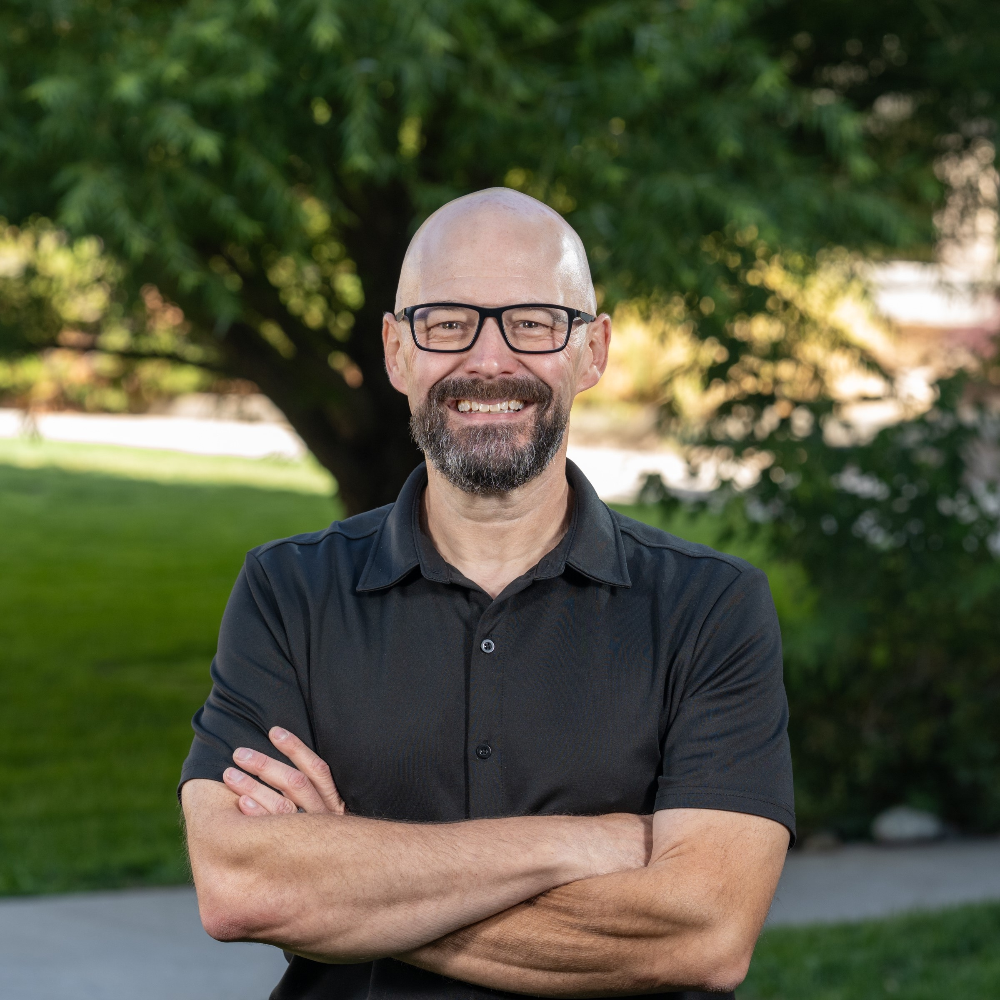
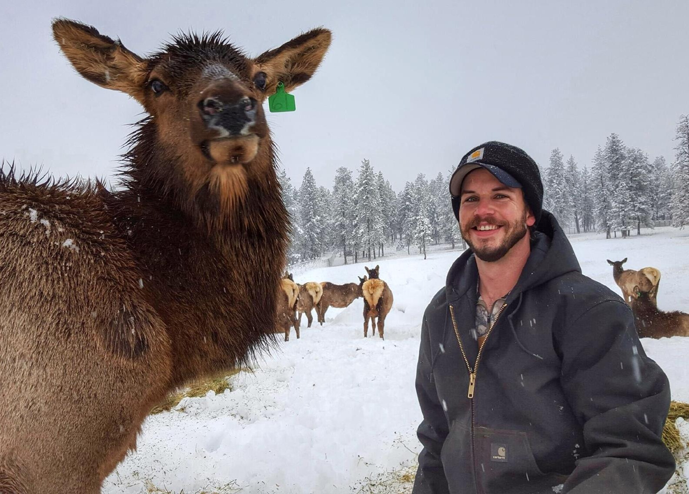
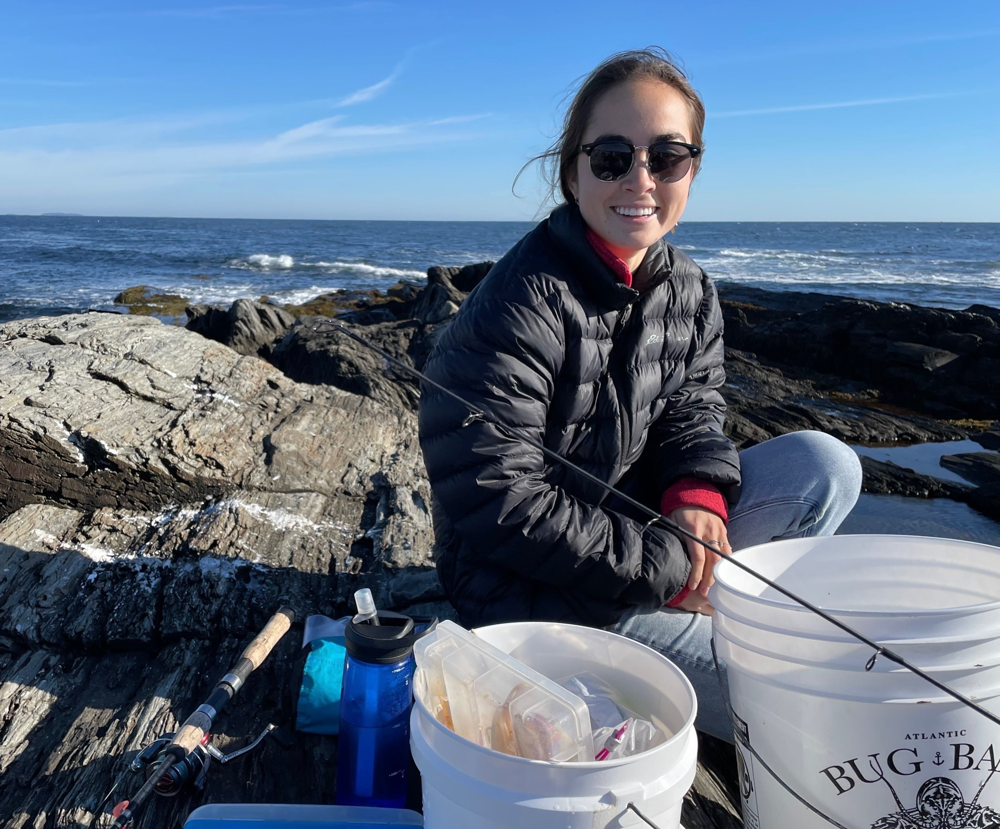
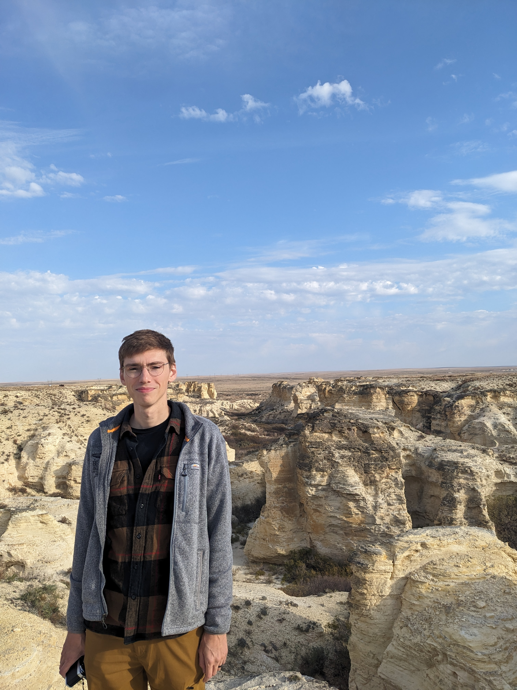

---
output:
  html_document:
    theme: yeti
---

### [**Dr. Jeffrey A. Falke -- Principal Investigator**]{.ul}

Jeff is originally from Blue Springs, MO. He graduated with a BS in Fisheries and Wildlife from the University of Missouri in 2000. During his undergraduate and shortly thereafter he held positions with the U.S. Geological Survey, the Missouri Department of Conservation, and the Arizona Game and Fish Department.  In 2004 he received an MS in Biology from Kansas State University (Advisor: Dr. Keith Gido), investigating the upstream effects of reservoirs on prairie stream fish assemblages.  He finished his PhD with Dr. Kurt Fausch in the Department of Fish, Wildlife & Conservation Biology at Colorado State University in 2009.  His dissertation research focused on the effects of groundwater withdrawal and drought on plains fishes and their habitats in eastern Colorado.  From 2009-2012 Jeff was a postdoctoral fellow with NOAA/National Research Council and Oregon State University before joining the Alaska Unit as Assistant Unit Leader-Fisheries in 2012. Jeff became the Alaska Unit Leader in 2019 and relocated to Reno, Nevada and the University of Nevada, Reno to become the Nevada Unit Leader in 2023. He has graduate faculty appointments with the Department of Natural Resources and Environmental Sciences and the Ecology, Evolution, and Conservation Biology Graduate Program. In his free time Jeff enjoys flatpicking acoustic guitar, fishing, and spending time with his family. 

### [**Current Lab Members**]{.ul}

We continue to build out the lab and are hiring graduate students and scientists to help with projects as they emerge. Check out funded student and post-doc opportunities [here](prospective_students.html)!

### **Post-Doctoral Scientists**

**Dr. Nathan Jackson (co-advised with Brian Folt)** Nathan is a large mammal ecologist interested in population ecology and the effects of density dependence on movement, demography, population dynamics, and competition (intra- and interspecific). Nathan’s research leverages movement and demographic datasets to inform conservation and management decisions for large, herbivorous mammals. Nathan holds a B.S. in Natural Resources-Wildlife Conservation and Management from the University of Arizona (2013), and an M.S. (2019) and Ph.D. (2024) in Natural Resources and Environmental Science from the University of Nevada, Reno. Nathan’s current research is focused on migratory behavior of ungulates in the Great Basin. His current work is done in co-production with state (Nevada Department of Wildlife) and federal agencies (U.S. Geological Survey Corridor Mapping Team). Email: [nathanjackson@unr.edu](mailto:nathanjackson@unr.edu)
 

**Dr. Dara Yiu ** Dara is an aquatic ecologist whose research explores the interactions between fishes, their habitats, and the food webs that connect them. Her work integrates a variety of interdisciplinary tools -- including traditional ecological surveys, stable isotope geochemistry, and genetic techniques -- to better understand how aquatic communities are structured and respond to environmental change. She gained experience with fish population surveys, biodiversity assessments, and restoration ecology through working in freshwater, estuarine, and marine habitats across the Pacific Northwest. In 2018, Dara earned a B.S. degree in Aquatic and Fishery Sciences from the University of Washington. In 2020, she began her Ph.D. research in the Gulf of Maine, where she investigated the effects of kelp forest loss on reef fishes and food webs. She completed her dissertation in 2025 and started as a post-doc with the Nevada Cooperative Fish and Wildlife Research Unit. There, she is studying the ecology of desert fishes and helping to develop a long-term monitoring program for endemic communities in Ash Meadows National Wildlife Refuge. 

### **Graduate Students**

**Christopher Frazier, PhD Student, EECB** is originally from Kalamazoo, Michigan and earned his B.S. in Biology from Central Michigan University in 2015 as a Ronald E. McNair Scholar. During his undergraduate education, he studied the feeding ecology of the invasive mysid shrimp Hemimysis anomala and invasive mussel impacts on Great Lakes plankton communities. From 2017-2019, he completed an M.S. in Biology at Western Michigan University, during which he studied how habitat conditions shape the functional and taxonomic structure of macroinvertebrate communities in Great Lakes interdunal wetlands. After his M.S., Chris worked as a laboratory manager at Texas A&M University–Corpus Christi (2019–2021), where he studied macroinvertebrate and fish community variation across a precipitation gradient in coastal Texas streams. From 2021 to 2025 he served as assistant researcher at the Kansas Biological Survey & Center for Ecological Research (University of Kansas), where he initially studied ephemeral wetland macroinvertebrate communities and macroecology of large branchiopods (fairy, tadpole, and clam shrimp) across the Great Plains, and later studied harmful algal blooms and ecosystem ecology in Kansas reservoirs. As of 2025, he is an NSF Graduate Research Fellow in Jeff Falke’s lab at the University of Nevada, Reno, where he studies how climate change and drought alter aquatic–terrestrial subsidies in aridland streams. Email: [christopherfrazier@unr.edu](mailto:christopherfrazier@unr.edu)

**Becky Shaftel, PhD Candidate, Fisheries (UAF)** grew up in Anchorage and has been working as a research scientist at the Alaska Center for Conservation Science at UAA since completing her Masters degree in 2010. She received a B.S. in Earth Systems from Stanford University and a M.S. in Biology from Baylor University. Becky started her PhD in the Freshwater Fish Ecology Lab in fall 2021 and will be working to develop models and tools that link Alaska’s changing climate to freshwater habitats that support salmon. Stream temperature optima vary across salmon species and life stages, and may vary across populations, which requires a flexible approach that can capture the range of current and future thermal conditions they may experience. Becky plans to utilize advancements in geospatial stream networks and climate science to model shifting thermal regimes that can be used to understand impacts specific to salmon life stages, which can help inform long-term sustainable management. Becky enjoys hiking, biking, and skiing with her family on the trails in Southcentral Alaska. Email: [rsshaftel@alaska.edu](mailto:rsshaftel@alaska.edu)

 

### **Staff**
 
**Mark Kolwyck, Freshwater Fisheries Specialist** holds a B.S. in Environmental Sustainability from Northern Arizona University.

 

**Brooke Goins, Freshwater Fisheries Technician** holds degrees in Biology (A.S., 2021) from the Truckee Meadows Community College and a B.S. in Wildlife Ecology and Conservation (2023) from the University of Nevada Reno. Brooke has worked with state and federal agencies on fisheries and wildlife management, and has interests in fish ecology, riparian systems, and conservation.

 
 

**Tanner Morgan, Student Fisheries Technician** is an undergraduate student pursuing a B.S. in Wildlife Ecology and Conservation in the Department of Natural Resources and Environmental Sciences, University of Nevada, Reno.

 
 
 

<!-- Simple Dark Blue Footer -->

  
 Copyright &copy; Jeff Falke, 2024--present. All rights reserved.

  

