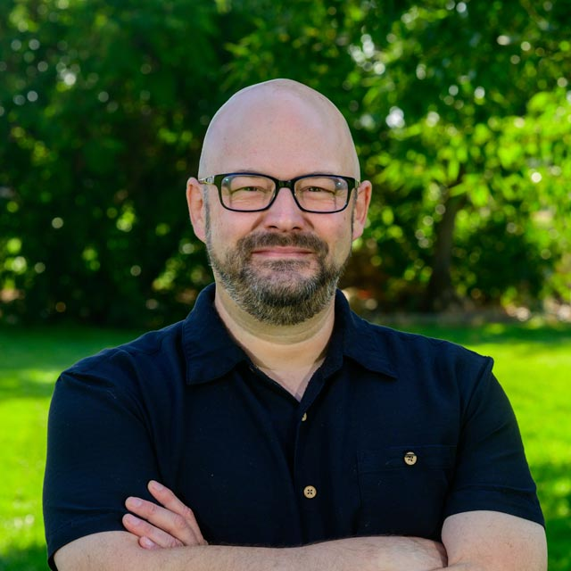
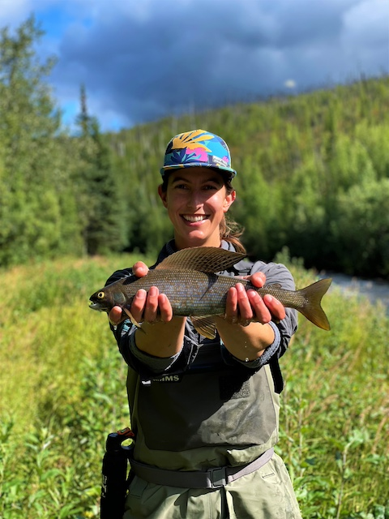
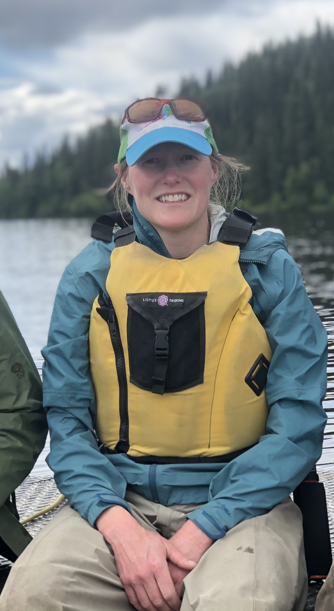

---
output:
  html_document:
    theme: yeti
---

### [**Dr. Jeffrey A. Falke -- Principal Investigator**]{.ul}

Jeff is originally from Blue Springs, MO. He graduated with a BS in Fisheries and Wildlife from the University of Missouri in 2000. During his undergraduate and shortly thereafter he held positions with the U.S. Geological Survey, the Missouri Department of Conservation, and the Arizona Game and Fish Department.  In 2004 he received an MS in Biology from Kansas State University (Advisor: Dr. Keith Gido), investigating the upstream effects of reservoirs on prairie stream fish assemblages.  He finished his PhD with Dr. Kurt Fausch in the Department of Fish, Wildlife & Conservation Biology at Colorado State University in 2009.  His dissertation research focused on the effects of groundwater withdrawal and drought on plains fishes and their habitats in eastern Colorado.  From 2009-2012 Jeff was a postdoctoral fellow with NOAA/National Research Council and Oregon State University before joining the Alaska Unit as Assistant Unit Leader-Fisheries in 2012. Jeff became the Alaska Unit Leader in 2019 and relocated to Reno, Nevada and the University of Nevada, Reno to become the Nevada Unit Leader in 2023. He has graduate faculty appointments with the Department of Natural Resources and Environmental Sciences and the Ecology, Evolution, and Conservation Biology Graduate Program. In his free time Jeff enjoys flatpicking acoustic guitar, fishing, and spending time with his family. 

### [**Current Lab Members**]{.ul}

We continue to build out the lab and are hiring graduate students and scientists to help with projects as they emerge. Check out funded student and post-doc opportunities [here](prospective_students.html)!

### **Staff**

**Mark Kolwyck, Freshwater Fisheries Specialist**
 
**Brooke Goins, Freshwater Fisheries Technician**
 
**Tanner Morgan, Freshwater Fisheries Technician**

### **Post-Doctoral Scientists**

### **Graduate Students**

**Elizabeth Hinkle, PhD Candidate, Fisheries** is from Kansas City, Kansas and moved to Corpus Christi, Texas in 2008 to earn her Bachelor of Arts in Philosophy and Bachelor of Science in Biology from Texas A&M University-Corpus Christi. There, she worked as an undergraduate research technician in a fisheries population genetics laboratory focusing on an Indo-Pacific goby species, Eviota sigillata. She also graduated with Honors from the University and completed a capstone project concentrated on understanding the innate human biases associated with endangered species protection. Following her undergrad, she worked for the Alaska Department of Fish and Game for four seasons before returning to school at the University of Texas at Tyler where she completed her Masters of Science in Biology in 2018. Her thesis focused on determining the host-fish and life history characteristics of a state-listed freshwater mussel species, Pleurobema riddellii.  She is now finishing her PhD with Jeff Falke at UAF where she is focusing on how wildfires and climate change are affecting aquatic systems within the boreal watershed. Elizabeth also has a wide swath of interests spanning from mycology to backpacking to gardening. Email: [ehinkle2@alaska.edu](mailto:ehinkle2@alaska.edu)

**Becky Shaftel, PhD Student, Fisheries** grew up in Anchorage and has been working as a research scientist at the Alaska Center for Conservation Science at UAA since completing her Masters degree in 2010. She received a B.S. in Earth Systems from Stanford University and a M.S. in Biology from Baylor University. Becky started her PhD in the Freshwater Fish Ecology Lab in fall 2021 and will be working to develop models and tools that link Alaska’s changing climate to freshwater habitats that support salmon. Stream temperature optima vary across salmon species and life stages, and may vary across populations, which requires a flexible approach that can capture the range of current and future thermal conditions they may experience. Becky plans to utilize advancements in geospatial stream networks and climate science to model shifting thermal regimes that can be used to understand impacts specific to salmon life stages, which can help inform long-term sustainable management. Becky enjoys hiking, biking, and skiing with her family on the trails in Southcentral Alaska. Email: [rsshaftel@alaska.edu](mailto:rsshaftel@alaska.edu)

 
 
 

<!-- Simple Dark Blue Footer -->

  
 Copyright &copy; Jeff Falke, 2024--present. All rights reserved.

  

