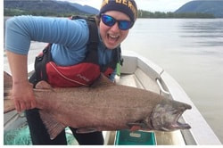
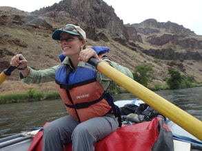
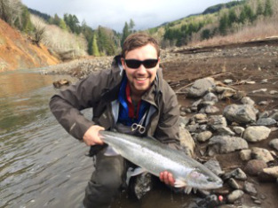
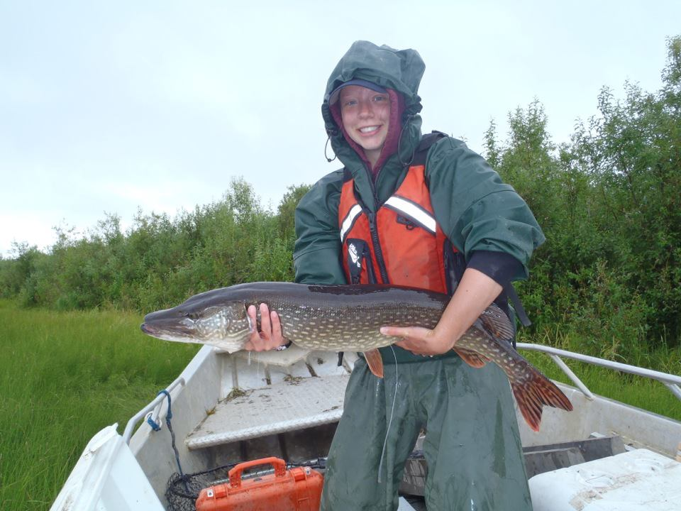

---
output:
  html_document:
    theme: yeti
---

### [**FFEL Alumni & Where are they now...**]{.ul}

 

**Will Samuel** (MS 2023) When beavers get burned, do fish get fried? The role of beavers to mediate wildfire effects on Arctic grayling in boreal Alaska. Current position: Research Professional, International Arctic Research Center, Unversity of Alaksa Fairbanks

 

**Claire Delbecq** (MS 2023) Impacts of streamflow variability and antecedent conditions on the magnitude, timing, and form of watershed carbon and nutrient export from a coastal Alaskan watershed. Current position: Habitat Biolgist 2, Alaska Department of Fish and Game, Douglas, Alaska

 
 

**Kevin Fitzgerald** (MS 2023) Environmental controls on foraging and growth of juvenile salmonids in a southeast Alaska watershed. Current position: Research Biologist, U.S. Forest Service, Pacific Northwest Research Laboratory, Juneau, Alaska

 

**Olivia Edwards** (MS 2023) Influence of freshwater processes on juvenile Chinook Salmon size, movement, and outmigration timing in the Chena River, Alaska. Current position: Habitat Biolgist 2, Alaska Department of Fish and Game, Fairbanks, Alaska

 

**Dr. Chris Sergeant** (PhD 2022) Freshwater pressures on pacific salmon in the coastal watersheds of Alaska. Current position: Research Scientist, School of Marine and Environmental Affairs, University of Washington, Seattle, Washington
 
 

**Taylor Cubbage** (MS 2022) Intraspecific variation and the leaping ability of Northern Pike (Esox lucius): implications for invasion ecology and management. Current position: Fishery Biologist 1, Alaska Department of Fish and Game, Anchorage, Alaska
 
 
 

 
**Dr. Stephen Klobucar** (Post-doc; 2018-2021) Aquatic ecosystem vulnerability to fire and climate change in Alaskan boreal forests. Current position:
 
 
 

 
**Donnie Arthur** (MS 2020) The reproductive biology of Yelloweye Rockfish (sebastes ruberrimus) in Prince William Sound and the Northern Gulf of Alaska. Current position: Fishery Biologist 2, Alaska Department of Fish and Game, Anchorage, Alaska
 
 
 

 
**Chase Jalbert** (MS 2018) Impacts of a top predator (Esox lucius) on salmonids in southcentral Alaska: genetics, connectivity, and vulnerability. Current position: Fisheries Geneticist 2, Alaska Department of Fish and Game, Anchorage, Alaska
 
 
 

 
**Kristin Neuneker** (MS 2017) Migration patterns and energetics of adult Chinook salmon (Oncorhynchus tshawytcha) in Alaska rivers. Current position: Fisheries Biologist 2, Sport Fish Division, Alaska Department of Fish and Game, Juneau, Alaska
 
 
 

 
**Chelsea Clawson** (MS 2017) Using remote sensing, occupancy estimation, and fine-scale habitat characterization to evaluate fall chum salmon (Oncorhynchus keta) spawning habitat usage in Arctic Alaska. Current position: Habitat Biologist 2, Alaska Department of Fish and Game, Fairbanks, Alaska
 
 
 

 
**Eric Torvinen** (MS 2017) Lake trout (Salvelinus namaycush) otoliths as indicators of past climate patterns and growth in Arctic lakes. Current position: 
 
 
 

 
**Dr. Morgan Sparks** (MS 2016; PhD. Purdue University 2023) Climate, embryonic development, and potential for adaptation to warming water temperatures by Bristol Bay sockeye salmon. Current position: Research Fish Biologist, U.S. Forest Service, Rocky Mountain Research Station, Boise, Idaho
 
 
 

 
**Allison Matter** (MS 2016) A rapid assessment method to estimate the distribution of juvenile Chinook salmon (Oncorhynchus tshawytcha) in an interior Alaska river basin. Current position: Fisheries Biologist II, Sport Fish Division, Alaska Department of Fish and Game, Fairbanks, Alaska
 
 
 

 
**Dr. Brock Huntsman** (Post-doc 2014-2015) Habitat use and population dynamics of Chinook salmon in the Chena River basin, Alaska. Current position: Fisheries Research Biologist, U.S. Geological Survey, California Water Science Center, Sacramento, California
 
 
 

 
**Dr. Kevin Fraley** (MS 2015; PhD University of Canterbury 2018) Seasonal movements and habitat use of rainbow trout in the Susitna River basin, southcentral Alaska. Current position: Fisheries Ecologist, Wildlife Conservation Society, Fairbanks, Alaska 

 
 

<!-- Simple Dark Blue Footer -->

  
 Copyright &copy; Jeff Falke, 2024--present. All rights reserved.

  

